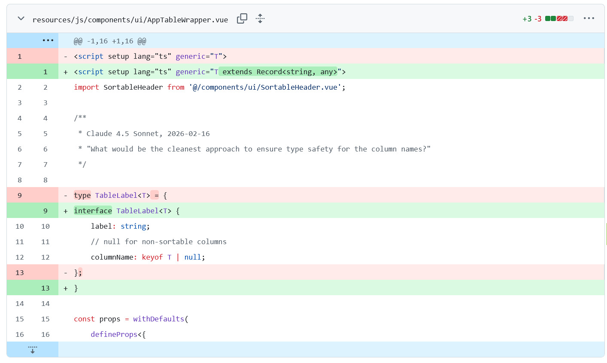

## Mermaid

`->>` -> request message
`-->>` -> return message

## Inertia

### Inertia headers

* result as html or json?
* is an inertia?
* inertia version?

## Architecture

* "high-level" means conceptual overview, not details
* vue composable -> kombinierbar
* encapsulates the full Leaflet map lifecycle -> All the steps needed to create, run, update, and destroy something are handled inside one place

## Config
* wmslayers = {} as const; -> checks for exact content, not just type string

## Eloquent
* Eloquent’s model lifecycle hooks - [TBD]

## Misc
method signature = funktionskopf `public function show(param): result`

## Measurement zu Point in Service class

Measurement repräsentiert jedes Datum

## :: vs -> in php

in PHP the :: operator (called the "scope resolution operator") is used to access static methods, static properties, and constants on a class without needing an instance of that class. In contrast, -> is used to access methods and properties on an object instance.

`User::factory()->create();`

## typescript

extends?
type vs interface?

